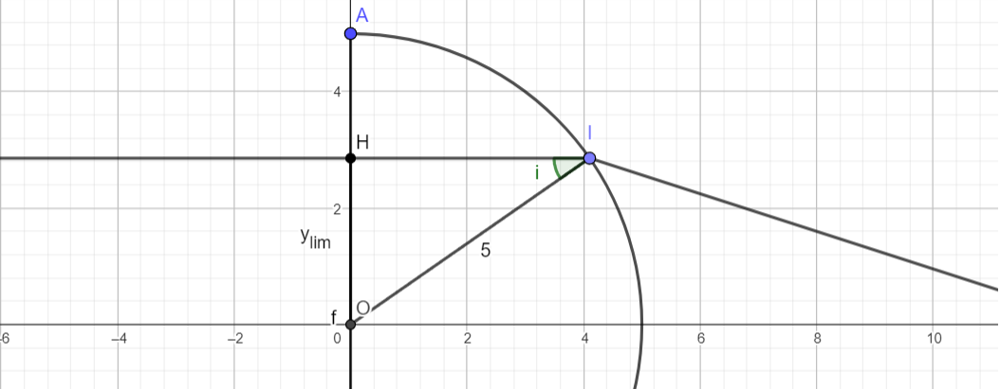
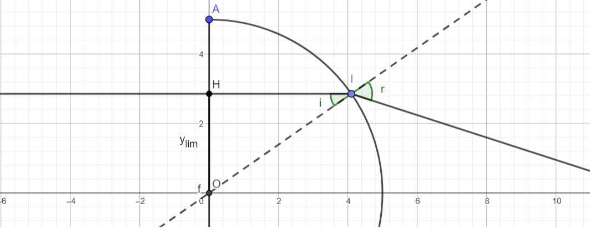
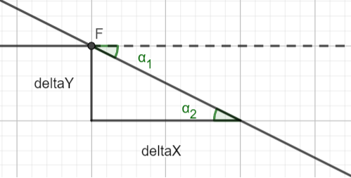
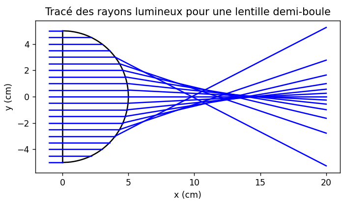

# Etude du stigmatisme pour une lentille demi-boule

1. La réfraction sur le premier dioptre est nul (c'est à dire que les rayons ne sont pas déviés) car les rayons arrivent perpendiculairement au dioptre.

2. Les rayons vont dans un milieu moins réfringent, cela veut dire qu'il n'existera pas toujours un rayon réfracté, car <u>l'angle de sortie</u> du rayon par rapport à la normale sera toujours <u>plus grand que l'angle d'incidence</u>. Il y aura donc un <u>angle limite</u> où il y aura <u>réflexion totale</u>, c'est-à-dire que le <u>rayon réfracté n'existe plus</u>.
   
   Nous avons un angle limite quand le rayon sortant est rasant (soit avec un angle $r$ de $\dfrac{\pi}{2}$). Trouvons l'angle $i_{lim}$ d'incidence. D'après les lois de Descartes, on a:
   
   $$
   \begin{align}
nsin(i) &= sin(r)\\
\iff nsin(i_{lim}) &= sin(\dfrac{\pi}{2})\\
\iff sin(i_{lim})  &= \dfrac{1}{n}\\
\iff      i_{lim}  &= arcsin(\dfrac{1}{n})\\
          &= arcsin(\dfrac{1}{1.5})\\
          &= \boxed{41.81°}
\end{align}
   $$
   
   Trouvons maintenant l'ordonnée $y_I$ correspondant. Pour cela, nous allons nous placer dans le triangle $OIH$, où $H$ est le projeté de $I$ sur l'axe des ordonnée:
   
   
   
   Nous avons donc:
   
   $$
   \begin{align}
sin(i_{lim}) &= \dfrac{y_{lim}}{R}\\
\iff y_{lim} &= 5sin(i_{lim})\\
  &= 5sin(41.81)\\
  &= \boxed{3.33cm}
\end{align}
   $$

3. En modélisant $I$, $i$, $r$, et la normale, on la figure suivante:
   
   

4. D'après les lois de Descartes, nous avons:
   
   $$
   \begin{align}
nsin(i) &= sin(r)\\
\iff r &= arcsin(nsin(i))\\
     r &= \boxed{arcsin(1.5sin(i))}
\end{align}
   $$
   
   Or de la même façon que dans 2, nous avons dans le triangle $OIH$:
   
   $$
   \begin{align}
sin(i) &= \dfrac{y_I}{R}\\
\Longrightarrow n\dfrac{y_I}{5} &= sin(r) \space (lois \space de \space Descartes)\\
\iff r &= \boxed{arcsin(0.3y_I)}
\end{align}
   $$

5. La déviation $D$ correspond à l'angle $r-i$: $D=\boxed{r-i}$.

6. Nous avons un (demi) cercle de rayon $5cm$ et de centre $O(0,0)$, ce qui peut s'exprimer de la façon suivante:
   
   $$
   \begin{align}
y_I^2 + x_I^2 &= 5^2\\
\iff x_I^2    &= 25 - y_I^2\\
\iff x_I      &= \boxed{\sqrt{25-y_I^2}} \space (x \space est \space toujours \space positif)
\end{align}
   $$
   
   On a donc $\boxed{I(\sqrt{25-y_I^2}, y_I)}$

7. Nous allons former l'équation réduite de la droite du rayon réfracté, de la forme $y = mx +p$.
   
   
   
   D'après ce schéma (où $\alpha_1 = \alpha_2 = D$), nous avons donc:
   
   $$
   \begin{align}
tan(D) &= -\dfrac{\Delta y}{\Delta x}\\
tan(r-i)    &= -\dfrac{\Delta y}{\Delta x}\\
         &= \boxed{-m}
\end{align}
   $$
   
   Trouvons alors l'ordonnée à l'origine sachant que $I(x_I,y_I)$ appartient à la droite:
   
   $$
   \begin{align}
y_I &= mx_I + p\\
\iff p &= y_I - mx_I\\
\iff p &= \boxed{y_I + tan(r-i)x_I}
\end{align}
   $$
   
   On a donc: $y = -tan(r-i)x + (y_I + tan(r-i)x_I)\\ \iff y = \boxed{tan(r-i)(x-x_I) + y_I}$

8. On peut modéliser des rayons grâce à python avec le programme suivant:
   
   ```python
   # Importation des bibliothèques utiles
   import numpy as np
   import matplotlib.pyplot as plt
   
   # Les constantes du problème
   n = 1.5 # C'est l'indice du milieu de la lentille
   R = 5 # C'est le rayon en cm de la lentille
   
   def angleInc ( yI ) :
       return -np.arcsin ( yI / R )
   
   # Définition de l'angle de réfraction angleRef (noté r dans l'étude théorique) en fonction de yI
   ylim = R/n
   def angleRef ( yI ) :
       if abs ( yI ) > ylim:
           return None
       else:
           return np.arcsin ( n*np.sin ( angleInc ( yI ) ) )
   
   # Définition de l'angle de déviation D
   def angleD ( yI ) :
       if abs ( yI ) > ylim:
           return None
       else:
           return angleRef ( yI ) - angleInc ( yI )
   
   # Abscisse du point I
   def xI (yI) :
       return np.sqrt ( R**2 - yI**2 )
   
   # Partie graphique proprement dite
   plt.plot ( [0,0] , [-R, R] , 'k-') # on trace le dioptre d'entrée
   
   # On trace un trait qui va du point (0, -R) au point (0, R).
   yS = np.linspace (-R, R, 500)
   
   plt.plot ( xI(yS) , yS , 'k-') # on trace le dioptre de sortie
   for yI in [k*R/10 for k in range(-10, 11)]:
       plt.plot ( [-1, xI(yI)] , [yI, yI] , 'b-') #On trace les rayons à gauche du dioptre sphérique.
       if abs (yI) < ylim:
           y2 = yI + np.tan (angleD (yI) ) * (20 - xI (yI) ) #On trace les rayons à droite du dioptre sphérique.
           plt.plot ([xI(yI), 20], [yI, y2], 'b-')
   
   plt.xlabel ("x (cm)")
   plt.ylabel ("y (cm)")
   plt.title ("Tracé des rayons lumineux pour une lentille demi-boule")
   plt.axis ('scaled') #pour avoir la même échelle sur les deux axes
   plt.show ()
   ```

9. Cela nous donne le graphique suivant:
   
   

10. On peut voir que plus les rayons sont écartés de l'axe optique, les rayons ne convergent pas en un point, le système n'est donc <u>pas stigmatique</u>. Alors que si les rayons sont tous relativement proches de l'axe optique, les rayons sortant convergent en un point. On est donc dans une situation de <u>stigmatisme approché</u>.
