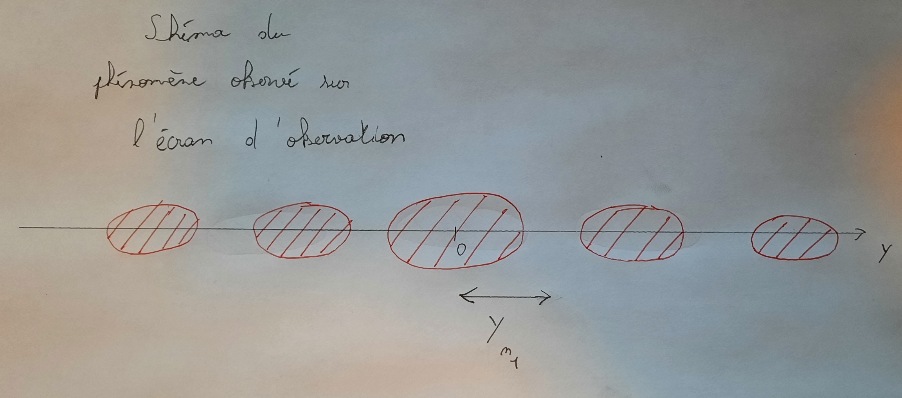

# Compte rendu TP Optique

## Etude de diffraction par une ouverture rectangulaire

Rappel: La diffraction est un phénomène typique des ondes. Elle peut se produire aussi bien sur les ondes mécaniques (ondes sonores par exemple) que sur des ondes éléctromagnétiques.

## Montage


<div style="page-break-after: always"></div>

## Phénomène observé



Quand on éclaire un laser a travers une fente rectangulaire, on pourrait s'attendre a un petit rectangle sur l'écran d'observation. Mais nous voyons plutot des points allongées et séparés. Ceci est un phénomène de diffraction que l'on cherche a étudier.\
Il est donné la formule $\sin(\theta) = n \dfrac{\lambda}{a}$ qu'on va chercher a vérifié.

## Etude de la dépendance de $\theta$ and fonction de $n$

Nous avons éffectué une première experience pour vérifié la proportionnalité entre $\theta$ et $n$ avec $n$ représentant l'indice de la $n$-ième extinction de lumière et $\theta$ l'angle entre le diaphragme et l'extinction en question.

Protocole proposé:
- Prendre une valeur de a, qui ne varira pas au fil de l'experience. Nous avon choisi $200µm$ car nous pouvons voir clairement un nombre étudiable d'extinctions.
- Eclairer le laser a travers la fente de $200µm$ et regarder le résultat sur l'écran d'observation.
- Mesurer la longueur entre le centre du point au centre et l'extinction que l'on étudie, on nomera cette distance la distance $y_n$
- Faire de même avec toutes les extinctions visibles

Ensuite il faut trouver les valeur de $\theta$:

Pour trouver $\theta$, on fais ainsi:
On se trouve dans le triangle $DON_1$ rectangle en $O$. On a donc $tan(\theta_{n})=\dfrac{y_n}{97}$.
Or nous travaillons avec des angle petits, donc nous avons simplement $\theta_{n}=\dfrac{y_n}{97}$


Nous avons trouvé les valeurs suivantes:
|$y_n$  |$\theta_n$        |
|---    |---               |
|$0.4$  |$4.1*10^{-3}$rad  |
|$0.8$  |$8.2*10^{-3}$rad  |
|$1.2$  |$1.2*10^{-2}$rad  |
|$1.6$  |$1.6*10^{-2}$rad  |

On peut alors mettre les points sur un graphique et vérifier qu'ils forment bien une droite. Le programme Python suivant nous permet de faire cela:
```python
import matplotlib.pyplot as plt
n = [1, 2, 3, 4] # pour les n extinctions mesurées à partir du centre
theta = [4.1e-3, 8.2e-3, 1.2e-2, 1.6e-2] # pour les n valeurs de q mesurées
plt.plot(n, theta, 'ro') # Trace theta en fonction de n, les points sont marqués par des ronds rouges.
plt.title("Angle theta en fonction de n") #Pour avoir un titre
plt.xlabel('n') #indique ce que l’on a en abscisses
plt.ylabel('theta') #indique ce que l’on a en ordonnées
plt.grid() #met un quadrillage sur la figure
plt.show()
```

Dérnièrement on peut effectuer une régression linéaire pour obtenir la pente de cette droite. Ceci peut être fait sur la calculatrice, sur régressi ou alors avec python:

```python
import matplotlib.pyplot as plt
import numpy as np
n = np.array([1, 2, 3, 4]) #pour pouvoir utiliser polyfit, on ne peut pas utiliser un simple ensemble de valeurs, comme on a fait ci-dessus, mais on crée une ligne de tableau.
theta = np.array([4.1e-3, 8.2e-3, 1.2e-2, 1.6e-2])
model = np.polyfit(n, theta, 1) #on crée le polynôme de degré 1 qui colle le plus à la courbe theta en fonction de n, donc theta = a * n +b
print(model) #Cela affiche les coefficients du polynôme précédent

#----------------------------#
#On peut aussi tracer la courbe, mais nous cherchons uniquement les coeficients, donc cela a peu d'importance.
plt.plot(n, theta, 'ro') # Trace theta en fonction de n, les points sont marqués par des ronds rouges.
plt.title("Angle theta en fonction de n") #Pour avoir un titre
plt.xlabel('n') #indique ce que l’on a en abscisses
plt.ylabel('theta') #indique ce que l’on a en ordonnées
thetamodel =model[0]*n #On crée le tableau de valeurs associées au modèle, ici le polynôme theta = a * n
plt.plot(n, thetamodel, 'b:') #On trace la droite associée au polynôme.
plt.show()
 ```


On trouve alors grace a l'algorithme de regression linéaire $\theta(n)=(4.3*10^{-3})n$

## Etude de la dépendance de $\theta$ and fonction de $a$

Nous avons éffectué une deuxième experience pour vérifié la dépendance de $\theta$ en fonction de $a$ avec $a$ représentant la taille de la fente par lequel on éclair le laser et $\theta$ l'angle entre le diaphragme et la première extinction.\
\
Protocole proposé:
- Cette fois, on va fixer une valeur de n. Nous avons pris 1, c'est-à-dire que l'on va étudier la première extinction a chaque reprise.
- Eclairer le laser a travers la fente de $200µm$ et regarder le résultat sur l'écran d'observation.
- Mesurer la longueur entre le milieu du point au centre et la première extinction, que l'on nomera $y_n$
- Faire de même avec un fente de $150µm$, $100µm$, $80µm$, $60µm$, $40µm$ et dernièrement $30µm$

Encore une fois nous avons $\theta_n = y_n$
Nous avons donc trouvé les valeurs suivantes:
|$a$        |$\theta_n$        |
|---        |---               |
|$200µm$    |$3.1*10^{-3}rad$  |
|$150µm$    |$4.1*10^{-3}rad$  |
|$100µm$    |$6.1*10^{-3}rad$  |
|$80µm$     |$8.2*10^{-3}rad$  |
|$60µm$     |$1.1*10^{-2}rad$  |
|$40µm$     |$1.6*10^{-2}rad$  |
|$30µm$     |$2.2*10^{-2}rad$  |

Or d'après la formule, $\theta$ serai inversement proportionel a $a$, cela veut dire que $\theta$ est proportionel a 1/a. On a donc:

|$\dfrac{1}{a}$ |$\theta_n$        |
|---            |---               |
|$5*10^{-3}µm$  |$3.1*10^{-3}$rad  |
|$6.6*10^{-3}µm$|$4.1*10^{-3}$rad  |
|$1*10^{-2}µm$  |$6.1*10^{-3}$rad  |
|$1.3*10^{-2}µm$|$8.2*10^{-3}$rad  |
|$1.7*10^{-2}µm$|$1.1*10^{-2}$rad  |
|$2.5*10^{-2}µm$|$1.6*10^{-2}$rad  |
|$3.3*10^{-2}µm$|$2.2*10^{-2}$rad  |


De la même façon que la première experience, on vérifie que les points sont bien alignés sur un graphique. Ensuite, on effectue la regression linéaire.


On trouve alors $\theta(a)=\dfrac{6.7*10^{-1}}{a}$

## Estimation de la longueur d'onde

Pour trouver une estimation de la longeur d'onde utilisé, il suffit de prendre $n=1$. cela nous donne:


$$\theta=\dfrac{n\lambda}{a}\iff\lambda=\dfrac{a\theta}{n}=a\theta=6.7*10^{-1}µm$$

Cela représente $670nm$, ce qui est une bonne approximation de la longueur d'onde utilisé avec une erreur de $\dfrac{670-650}{650}\approx3\%$

<script type="text/javascript" src="http://cdn.mathjax.org/mathjax/latest/MathJax.js?config=TeX-AMS-MML_HTMLorMML"></script>
 <script type="text/x-mathjax-config">
     MathJax.Hub.Config({ tex2jax: {inlineMath: [['$', '$']]}, messageStyle: "none" });
 </script>