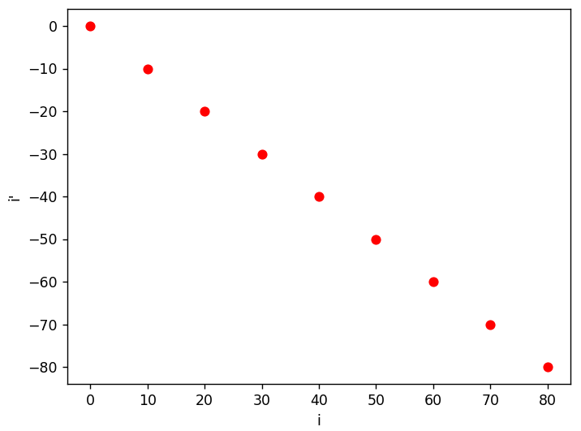
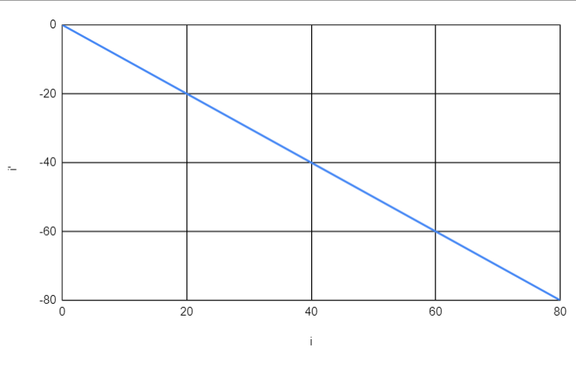
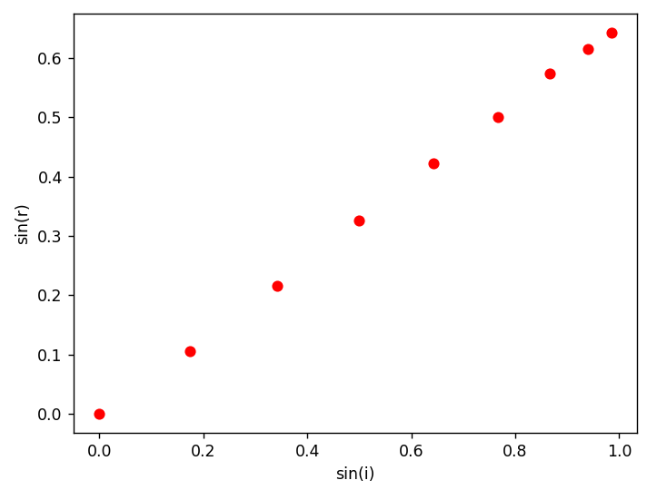
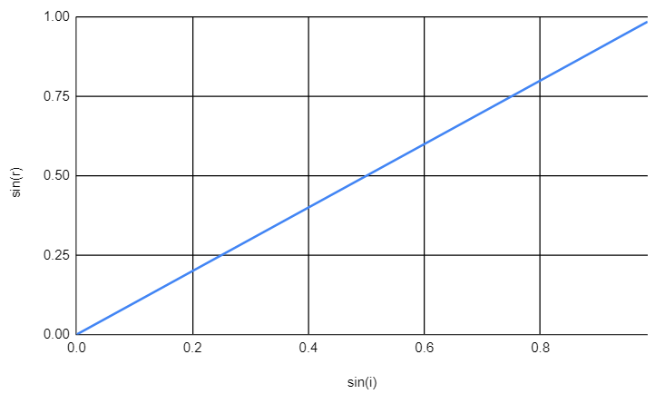

# Compte rendu TP2 Optique

## Etude de la réfraction par un dioptre plan

<u>Objectif:</u> Vérifier les lois de Descartes et déterminer l'indice du plexiglas.

# Montage

On dispose d'un laser, d'un hémicylindre en plexiglas posé sur un disque gradué en degrés.

# Réflexion

<u>Expérience:</u> On aligne le côté rectiligne de l'hémicylindre avec l'angle 90° du disque. Ensuite, on faire tourner le disque de 10° en 10° en notant l'angle du rayon réfléchit a chaque étape. On a obtenue les valeurs suivantes:

| $i$  | 0   | 10  | 20  | 30  | 40  | 50  | 60  | 70  | 80  |
|:---- |:---:|:---:|:---:|:---:|:---:|:---:|:---:|:---:|:---:|
| $i'$ | 0   | -10 | -20 | -30 | -40 | -50 | -60 | -70 | -80 |

1. On le trace avec Python
   
   ```python
   import matplotlib.pyplot as plt
   import numpy as np
   
   i = np.array([0,10,20,30,40,50,60,70,80])
   i_prime = np.array([0,-10,-20,-30,-40,-50,-60,-70,-80])
   
   plt.xlabel("i")
   plt.ylabel("i'")
   plt.plot(i, i_prime, 'ro')
   plt.show()
   ```
   
   

2. Avec un tableur (excel ici)
   
   

## Réfraction air-pléxiglas

<u>Expérience:</u> On répète les mêmes étapes mais cette fois-ci en notant l'angle du rayon réfracté. On va aussi calculer les valeurs de $sin(i)$ et $sin(r)$ pour pouvoir trouver l'indice de réfraction d u plexiglas. On a trouvé les valeurs suivantes:

| $i$       | 0   | 10    | 20    | 30    | 40    | 50    | 60    | 70    | 80    |
|:--------- |:---:|:-----:|:-----:|:-----:|:-----:|:-----:|:-----:|:-----:|:-----:|
| $r$       | 0   | 6     | 12.5  | 19    | 25    | 30    | 35    | 38    | 40    |
| $sin(i)$  | 0   | 0.174 | 0.342 | 0.5   | 0.643 | 0.766 | 0.866 | 0.940 | 0.985 |
| $sin(i')$ | 0   | 0.105 | 0.216 | 0.326 | 0.423 | 0.5   | 0.574 | 0.616 | 0.643 |

De la même façon, on peut placer $sin(r)$ en fonction de $sin(i)$ de 2 manières différentes:

1. Avec python
   
   ```python
   import matplotlib.pyplot as plt
   import numpy as np
   
   sin_i = [0, 0.174, 0.342, 1/2, 0.643, 0.766, 0.866, 0.940,0.985]
   sin_r = [0, 0.105, 0.216, 0.326, 0.423, 1/2, 0.574, 0.616, 0.643]
   
   plt.xlabel("sin(i)")
   plt.ylabel("sin(r)")
   plt.plot(sin_i, sin_r, 'ro')
   plt.show()
   ```
   
   

2. Avec Excel
   
   

## Réfraction pléxiglas

<u>Expérience:</u> On a expérimentalement déterminé la valeur de l'angle limite de réfraction. Nous avons trouvé environs $\fbox{42°}$.

## Déterminer l'indice de réfraction du plexiglas

1. Avec la régression linéaire de la partie 2
   
   ```python
   import matplotlib.pyplot as plt
   import numpy as np
   
   sin_i = [0, 0.174, 0.342, 1/2, 0.643, 0.766, 0.866, 0.940,0.985]
   sin_r = [0, 0.105, 0.216, 0.326, 0.423, 1/2, 0.574, 0.616, 0.643]
   
   [a, b] = np.polyfit(sin_r, sin_i, 1)
   print(a, b)
   ```
   
   Avec ce programme, on trouve: $sin(i)=1.51sin(r)$. Soit un indice de $\fbox{n=1.51}$

2. A partir d'une exploitation statistique des mesures de la partie 2
   
   Grâce à python, on va pouvoir obtenir une liste de valeurs d'indices et en faire la moyenne. On pourra aussi préciser l'écart-type.
   
   ```python
   import matplotlib.pyplot as plt
   import numpy as np
   
   sin_i = [0, 0.174, 0.342, 1/2, 0.643, 0.766, 0.866, 0.940,0.985]
   sin_r = [0, 0.105, 0.216, 0.326, 0.423, 1/2, 0.574, 0.616, 0.643]
   
   indices = []
   for si, sr in zip(sin_i, sin_r):
       if sr!=0:
           indices.append(si/sr)
   moyenne = np.average(indices)
   ecart_type = np.std(indices)
   print(moyenne)
   print(ecart_type)
   ```
   
   On a alors un indice $\fbox{n=1.55}$ avec un écart-type de $0.046$.

3. A partir de l'angle limite de réfraction
   
   $$
   \begin{align}
nsin(42)&=sin(90)\\
\iff n&=\dfrac{sin(90)}{sin(42)}\\
\iff n&=\dfrac{1}{sin(42)}\\
\iff n&= \fbox{1.49}
\end{align}
   $$
   
   On a donc $\fbox{n=1.49}$

## Exercice 5

1. On peut observer les rayons lumineux allant du point $A$ jusqu'à la surface de l'eau.

2. a)
   
   $$
   tan(i') = \dfrac{L}{H-(h-h')}

   $$
   
   b)
   
   $$
   tan(i') = \dfrac{l}{h'}

   $$
   
   c)
   
   $$
   tan(i) = \dfrac{l}{h}

   $$
   
   d)
   
   $$
   sin(i')=nsin(i)
   $$

3. On peut approximer que $h=8.7cm$ et $h'=6cm$.

4. Nous avons donc:
   
   $$
   \begin{align}
tan(i') &= \dfrac{L}{H-(h-h')}\\
&= \dfrac{25}{48-(8.7-3)}\\
&= \dfrac{250}{423}\\
\iff i'&=arctan(\dfrac{250}{423})\\
&= \fbox{30.6°}
\end{align}
   $$
   
   Nous pouvons alors en déduire $l$:
   
   $$
   \begin{align}
l &= tan(i')h'\\
&= 6tan(30.6)\\
&= \fbox{3.55cm}
\end{align}
   $$
   
   Ceci va nous permettre de trouver $i$:
   
   $$
   \begin{align}
tan(i) &= \dfrac{l}{h}\\
&= \dfrac{3.55}{8.7}\\
\iff i &= arctan(\dfrac{3.55}{8.7})
&= \fbox{22.2°}
\end{align}
   $$
   
   Or d'après notre dernière relation:
   
   $$
   \begin{align}
sin(i') &= nsin(i)\\
\iff n  &= \dfrac{sin(i')}{sin(i)}\\
&= \dfrac{sin(30.6)}{sin(22.2)}\\
&= \fbox{1.35}
\end{align}
   $$

Nous avons donc une approximation de l'indice de l'eau a environ 1.35. Ce qui est assez proche de la valeur réel d'environ 1.33. Soit un décalage de $\dfrac{1.35-1.33}{1.33}= 1.5\%$
