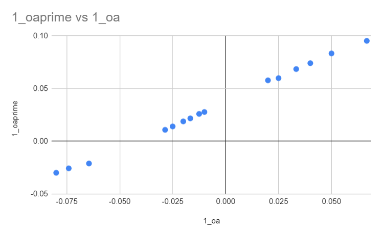

# Compte rendu TP3 Optique

## Introduction aux lentilles minces

<u>Objectif:</u> Vérifier la formule de conjugaison, dite de Descartes, donnant la position de l'image $A'$ d'un point objet $A$, situé sur l'axe optique:

$$
\dfrac{1}{\overline{OA'}} - \dfrac{1}{\overline{OA}} = \dfrac{1}{f'}
$$

## Expériences

Nous avons étudiés 3 cas possible avec une lentille mince convergente de vergence $+4\delta$:

- Objet et image réel
  
  

- Objet réel, Image virtuelle
  
  

- Objet virtuelle, Image réel
  
  

Dans chaque cas, nous avons effectué plusieurs mesures de $\overline{OA'}$ pour des distances de $\overline{OA}$ différentes. Cela nous a permit d'obtenir les tableau de valeurs suivant:

| $\overline{OA}$ | $\overline{OA'}$ | $\dfrac{1}{\overline{OA}}$ | $\dfrac{1}{\overline{OA'}}$ |
| --------------- | ---------------- | -------------------------- | --------------------------- |
| $-100cm$        | $36cm$           | $-0.01cm$                  | $0.028cm$                   |
| $-80cm$         | $38.5cm$         | $-0.0125cm$                | $0.026cm$                   |
| $-60cm$         | $46cm$           | $-0.0167cm$                | $0.022cm$                   |
| $-50cm$         | $53cm$           | $-0.02cm$                  | $0.019cm$                   |
| $-40cm$         | $71cm$           | $-0.025cm$                 | $0.014cm$                   |
| $-35cm$         | $92cm$           | $-0.029cm$                 | $0.01cm$                    |
| $-15.5cm$       | $-47.5cm$        | $-0.065cm$                 | $-0.021cm$                  |
| $-13.5cm$       | $-39cm$          | $-0.074cm$                 | $-0.027cm$                  |
| $-12.5cm$       | $-33.5cm$        | $-0.05cm$                  | $-0.03cm$                   |
| $15cm$          | $10.5cm$         | $0.07cm$                   | $0.1cm$                     |
| $20cm$          | $12cm$           | $0.05cm$                   | $0.08cm$                    |
| $25cm$          | $13.5cm$         | $0.04cm$                   | $0.074cm$                   |
| $30cm$          | $14.6cm$         | $0.03cm$                   | $0.07cm$                    |
| $40cm$          | $16.7cm$         | $0.025cm$                  | $0.06cm$                    |
| $50cm$          | $17.3cm$         | $0.02cm$                   | $0.058cm$                   |

Ce tableau va nous permettre de tracer les courbes suivantes.

### La courbe de la fonction $\overline{OA'}=f(\overline{OA})$


### La courbe de la fonction $\dfrac{1}{\overline{OA'}} = f(\dfrac{1}{\overline{OA}})$



### Régression linéaire

On peut remarquer que la courbe de $\dfrac{1}{\overline{OA'}} $ en fonction de $\dfrac{1}{\overline{OA}}$ est linéaire, on peut alors effectuer la régression linéaire de celle-ci avec Regressi. On trouve alors 

$$
\dfrac{1}{\overline{OA'}} =\dfrac{0.90}{\overline{OA}} + 0.038
$$

Or, nous pouvons déterminé que l'ordonnée à l'origine de cette fonction correspond a l'inverse de la distance focale de la lentille. Ceci est le cas car l'ordonné à l'origine est équivalent à:

$$
\dfrac{1}{\overline{OA}} = 0 \iff \overline{OA} \rightarrow + \infty
$$

 Soit un objet à l'infini, or nous savons que l'image d'un objet à l'infini ce trouve sur le foyer image de la lentille.

On a donc $\dfrac{1}{f'}=0.038cm \iff f'=\boxed{26.3cm}$.

On a donc vérifié la formule de Descartes (à quelques imprécisions près):

$$
\boxed{\dfrac{1}{\overline{OA'}} - \dfrac{1}{\overline{OA}} = \dfrac{1}{f'}}
$$

---

## Python

Avec le script python suivant, on peut tracer les même courbes:

```python
import matplotlib.pyplot as plt
import numpy as np

oa = [-100,-80, -60,-50,-40,-35, -15.5, -13.5, -12.5, 15,20,25,30,40,50]
oaprime = [36,38.5,46,53,71,92,-47.5,-39,-33.5,10.5,12,13.5,14.6,16.7,17.3]
oa_inv = [1/dist for dist in oa]
oaprime_inv = [1/dist for dist in oaprime]

plt.xlabel ("1/oa")
plt.ylabel ("1/oa'")
plt.plot(oa_inv, oaprime_inv, 'ro')
plt.show()
```


De même, on peut effectuer un régression linéaire avec python. Naturellement, on trouve la même fonction.

## Analyse de mesures

On peut aussi estimer la valeur de $f'$ en faisant la moyenne de chaque valeur de $f'$ à chaque mesure. On peut élaborer la formule de $f'$ suivante grâce à la formule de conjugaison:

$$
\begin{align}
\dfrac{1}{\overline{OA'}} - \dfrac{1}{\overline{OA}} &= \dfrac{1}{f'}\\
\iff \dfrac{1}{f'} &= \dfrac{\overline{OA} - \overline{OA'}}{\overline{OA} \times \overline{OA'}}\\ 
\iff f' &= \boxed{\dfrac{\overline{OA} \times \overline{OA'}}{\overline{OA} - \overline{OA'}}}\\ 

\end{align}
$$

Avec python, on peut alors facilement, trouver les valeurs de $f'$ et en faire la moyenne.

```python
import numpy as np

oa = [-100,-80, -60,-50,-40,-35, -15.5, -13.5, -12.5, 15,20,25,30,40,50]
oaprime = [36,38.5,46,53,71,92,-47.5,-39,-33.5,10.5,12,13.5,14.6,16.7,17.3]

fprime = [(x*y)/(x-y) for (x, y) in zip(oa, oaprime)]
f_avg = np.average(fprime)
```

On trouve alors un valeur de $f' = \boxed{26.4cm}$, avec un écart-type de $3.60cm$.

## La courbe de $f'$ en fonction de $\overline{OA}$

On peut aussi tracer la courbe de $f'$ en fonction de $\overline{OA}$:


D'après la formule de conjugaison, $f'$ est inversement proportionnel à $\overline{OA}$ donc il est normal de retrouver une hyperbole. On a aussi tracé la valeur de $f' $ trouvé précédemment. Il semblerait que cette valeur serait la limite de cette fonction quand $\overline{OA} \rightarrow +\infty$. Cela à bien un sens car d'après la formule de $f'$ trouvé précédemment, quand $\overline{OA} \rightarrow +\infty$, On trouve alors:

$$
\begin{align}
lim_{\overline{OA} \rightarrow +\infty} f' &= lim_{\overline{OA} \rightarrow +\infty} \dfrac{\overline{OA} \times \overline{OA'}}{\overline{OA} - \overline{OA'}} \\
&= \dfrac{\overline{OA'}}{1}\\
&= \boxed{\overline{OA'}}
\end{align}
$$

Et comme noté précédemment, quand un objet se trouve à l'infini, son image se trouve sur le foyer image de la lentille, c'est à dire $\overline{OA'} = f'$.
