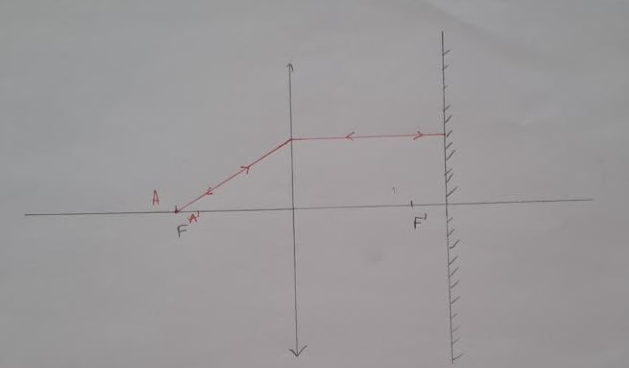

# Compte rendu tu TP3 Optique: Focométrie des lentilles minces

<u>Objectif: </u> Présenter différentes méthodes permettant de déterminer la distance focale d’une lentille mince. On s’intéressera aux lentilles convergentes avant de passer à l’étude des lentilles divergentes.

## Etude d'une lentille convergente

### Méthode d'autocollimation



L'influence de la distance entre la lentille et le miroir est nulle car les rayons sortes parallèlement à l'axe optique.

Si on pivote légèrement le miroir, on aura une image légèrement à coté (et on pourra alors voir si elle est nette).

<u>Expérience:</u> Comme présenté dans l'étude précédemment, on peut légèrement décalé le miroir pour voir a quelle distance de l'objet la lentille doit être pour retrouvé une image nette sur le plan focale image (superposé au plan focale objet)

Nous avons effectué l'expérience avec une lentille $+3\delta$. Nous avons trouvé une distance $\overline{OA}$ de $33cm$ où l'image est nette. Donc la lentille à une focale de $\boxed{33 \pm 2cm}$ dû aux incertitudes du montage (approximation de la position de l'objet et de la lentille, épaisseur de la lentille, etc...)

### Méthode de Bessel

D'après une démonstration du cours, on trouve que pour avoir une image nette sur un écran on doit avoir la condition suivante, avec $D = \overline{AA'}$, la distance entre l'objet et l'image:

$$
D \ge 4f'
$$

Avec 2 position possibles pour la lentille:

$$
\overline{AO_{1/2}}=\frac{-D\pm\sqrt{D^2-4Df')}}{2}
$$

On a alors:

$$
\begin{align}
d &= \overline{AO_1} - \overline{AO_2}\\
&= \frac{-D+\sqrt{D^2-4Df')}}{2} - \frac{-D-\sqrt{D^2-4Df')}}{2}\\
&= \sqrt{(D^2-4Df')}\\
\iff d^2 &= D^2 - 4Df'\\
\iff f' &= \boxed{\frac{D^2-d^2}{4D}}
\end{align}
$$

<u>Expérience:</u> Nous avons fait 6 mesures de $d$ avec des valeurs de $D$ connus (pour une lentille de vergence $+5\delta$), ce qui nous a permis de trouver 6 valeur de $f'$ d'après le calcul précédent.

| $D(cm)$  | 140  | 145  | 150  | 155  | 160   | 165  |
|:--------:|:----:|:----:|:----:|:----:|:-----:|:----:|
| $d(cm)$  | 90.1 | 97.6 | 102  | 108  | 112.6 | 118  |
| $f'(cm)$ | 20.5 | 19.8 | 20.1 | 20.0 | 20.2  | 20.2 |

On peut alors faire l'étude de ces valeurs, grâce a python par exemple:

```python
import numpy as np

fprime = [20.5,19.8,20.1,20,20.2,20.2]
moyenne = np.average(fprime)
ecart_type = np.std(fprime)
print(moyenne)
print(ecart_type)
```

On trouve alors la moyenne de $f'\approx\boxed{20.3cm}$ avec un écart-type de $0.213cm$.

### Méthode des points conjugués

(Voir TP3)

### Méthode de Badal

D'après les formules de Newton pour la lentille $L_2$:

$$
\overline{F_2A}\times\overline{F'_2A'} = -f'^2_2
$$

Or, d'après le montage, $F_2=O$, $A=F'$ et $\overline{F'_2A'}=\overline{d}$. On a alors:

$$
\begin{align}
\overline{OF'}\times\overline{d} &= -f'^2_2\\
\iff \overline{d} &= \frac{-f'^2_2}{\overline{OF'}}\\
                  &= \boxed{\frac{-f'^2_2}{\overline{f'}}}

\end{align}
$$

<u>Expérience:</u> Nous avons trouvé une distance $\overline{d}=-18.6cm$. Donc d'après la formule établit précédemment:

$$
\begin{align}
\overline{d} &= -\frac{f'^2_2}{f'}\\
\iff f' &= -\frac{f'^2_2}{\overline{d}}\\
\iff f' &= \frac{-25^2}{-18.6}\\
\iff f' &\approx \boxed{33.6cm}

\end{align}
$$

---

Toute ces méthodes on leurs avantages et leurs inconvénients. La méthode d'autocollimation est simple mais peut être imprécise. La méthode de Bessel fonctionne bien mais requiert un montage assez grand pour avoir un écran assez loin. Ensuite, La méthode des points conjugué fonctionne très bien, mais puisque l'on travail avec l'inverse de nombre, une petite imprécision peut être amplifié grandement. Finalement, la méthode de Badal est précise mais requiert un objet à l'infini, et donc d'autres lentilles, avec des vergences connu.

Après toutes les expériences, on trouve une valeur moyenne de $f'\approx\boxed{33.3cm}$ (pour la lentille de $+3\delta$)

---

## Etude d'une lentille divergente

### Méthode de Badal

Nous avons trouvé cette fois-ci $\overline{d}=18.7cm$, et donc:

$$
\begin{align}
\overline{d} &= -\frac{f'^2_2}{f'}\\
\iff f' &= -\frac{f'^2_2}{\overline{d}}\\
\iff f' &= \frac{-25^2}{18.7}\\
\iff f' &\approx \boxed{-33.4cm}

\end{align}
$$

### Méthode de neutralisation

Nous savons que la vergence $V$ d'un doublet de lentilles est égale à la somme des vergences des lentilles: $V = V_1 + V_2$. Dans cette suituation, nous cherchons $V_1$ et  $V_2$ est connu. Il s'agit alors de déterminer la vergence $V$ du doublet pour en déduire $V_1$. Pour cela, nous allons utilisé la méthode d'autocollimation. Nous avons pris une lentille de vergence $V_2=+8\delta$.

L'expérience nous indique une distance focale de $20.5cm$, soit une vergence $V=+4.88\delta$. Nous avons alors $V_1 = V - V_2 = 4.88- 8 =-3.12\delta$, soit $f'=\boxed{-32.1cm}$

### Méthode de points conjugués

<u>Expérience:</u> Nous avons fait 2 mesures pour les 3 cas différents:

- Objet réel, image virtuelle

- Objet virtuel, image réelle

- Objet virtuel, image virtuelle

| $\overline{OA}(cm)$  | 14.5 | 12   | -35   | -20 | 115 | 135 |
|:--------------------:|:----:|:----:|:-----:|:---:|:---:|:---:|
| $\overline{OA'}(cm)$ | 28   | 19.5 | -15.5 | -12 | -48 | -45 |

Pour chaque mesure, on peut calculer la valeur de $f'$ grâce à la formule de conjugaison:

$$
\begin{align}
\dfrac{1}{\overline{OA'}} - \dfrac{1}{\overline{OA}} &= \dfrac{1}{f'}\\
\iff f' &= (\frac{1}{\overline{OA'}} - \frac{1}{\overline{OA}})^{-1}
\end{align}
$$

On trouve alors:

| $f'(cm)$ | -30 | -31 | -28 | -30 | -34 | -34 |
|:--------:|:---:|:---:|:---:|:---:|:---:|:---:|

On a alors, $f'\approx\boxed{-31.1cm}$ avec une écart-type de $2.20$.

---

On a donc ici une valeur moyenne de $f'\approx\boxed{-32.2cm}$.
