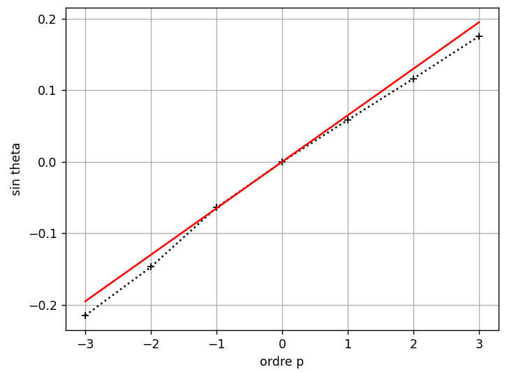
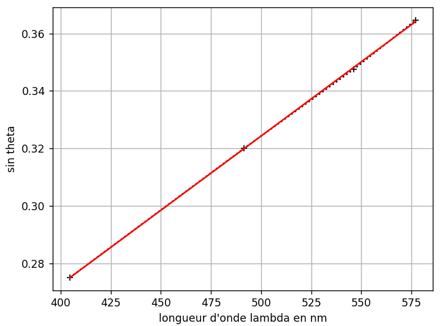

# Spectroscope a Réseau

## Vérification de la formule des réseaux

Il s'agit de vérifier la formule des réseaux en se plaçant sous incidence normale:

$$
sin(\theta) = pn\lambda
$$

### 1ère expérience

Dans cette expérience, on cherche a vérifier la dépendance de $sin(\theta)$ et fonction de $p$ pour un $\lambda$ fixé.

On a choisi de mesurer l'angle de la première feinte jaune, qui a une longueur d'onde $579.1\times10^{-6}m$ et $n=100\times10^{3}$.

| P   | $\theta$   |
| --- | ---------- |
| 0   | 0          |
| 1   | $2.5°51'$  |
| 2   | $6.5°10'$  |
| 3   | $9.5°36'$  |
| -1  | $-2.5°10'$ |
| -2  | $-6.7°15'$ |
| -3  | $-10.5°6'$ |

Le programme suivant permet de tracer la courbe de $sin(\theta)$ en fonction de $p$ ainsi que la régression linéaire de celle-ci:

```python
import matplotlib.pyplot as plt
import numpy as np
from math import pi

p = np.array([-3, -2, -1, 0, 1, 2, 3])
theta_degre = np.array([-11.5-54/60, -7.7-45/60, -3.5-10/60, 0, 2.5+51/60, 6.5+10/60, 9.5+36/])
theta_rad = pi/180 *theta_degre
y = np.sin(theta_rad)

plt.plot(p, y, 'k+:')
plt.xlabel("ordre p")
plt.ylabel("sin theta")
plt.grid()
#plt.show()

# Vérification du modèle

[a, b] = np.polyfit(p, y, 1)
print(a, b)

ymodel = a* p
plt.plot(p, ymodel,'r-')
plt.show()

print("La pente vaut ", round(a, 4))
```



On remarque que les grandeurs sont bien proportionnelles, comme attendu.

### 2ème expérience

Maintenant, on cherche a vérifier la dépendance de $sin(\theta)$ en focntion de $\lambda$, pour cela on va fixer cette fois-ci $p=1$ et on garde $n=100\times10^3m$.

| $\lambda$ |
| --------- |
| $166°28'$ |
| $169°10'$ |
| $170°50'$ |
| $171°53'$ |

De même, avec python on peut tracer les points, et la droite correspondante:

```python
import matplotlib.pyplot as plt
import numpy as np
from math import pi

l = np.array([404.7, 491.6, 546.1, 577.0]) 
theta_degre = [166 + 28/60, 169 + 10/60, 170 + 50/60, 171 + 53/60]
theta_degre = np.array([a-(150.5) for a in theta_degre])

theta_rad = pi/180 *theta_degre
y = np.sin(theta_rad)

plt.plot(l, y, 'k+:')
plt.xlabel("longueur d'onde lambda en nm")
plt.ylabel("sin theta")
plt.grid()
#plt.show()

# Vérification du modèle

[c, d] = np.polyfit(l, y, 1)
print(c, d)

ymodel = c* l + d
plt.plot(l, ymodel,'r-')
plt.show()

print("La pente vaut ", round(c, 4))
```



<u>Conlusion:</u> On a vérifié la dépendance de $sin(\theta)$ en fonction de $p$ et de $\lambda$, et dans tout les cas, les grandeurs étaient proportionnels, donc la formule est bien vérifié.

## Détermination du pas du réseau

La précision de la mesure de lambda va être de l'ordre de quelques minutes d'angles.

On va pouvoir utiliser la méthode de Monte-Carlo pour estimer la fréquence spatiale du réseau (soit le nombre de traits par mm). Le programme python suivant permet de faire exactement cela:

```python
import matplotlib.pyplot as plt
import numpy as np
import numpy.random as rd
from math import pi

l = np.array([404.7, 491.6, 546.1, 577.0]) 
theta_degre = [166 + 28/60, 169 + 10/60, 170 + 50/60, 171 + 53/60]
theta_degre = np.array([a-(150.5) for a in theta_degre])

dtheta_degre =2/30  # imprécision sur la mesure des angles de 2 min
N = 10000

aMC = []

for i in range(N):
    theta_degreMC = theta_degre + dtheta_degre * rd.uniform(-1, 1, len(theta_degre))
    theta_radMC = pi/180 *theta_degreMC
    yMC = np.sin(theta_radMC)
    [a, b] = np.polyfit(l, yMC, 1)
    aMC.append(a)

amoy =np.average(aMC)
ua = np.std(aMC)
print(amoy, ua)

pas_moy = amoy * 10**6
upas = ua * 10**6
print(pas_moy, upas)

print("Le pas vaut ", round(pas_moy, 0), "traits par mm")
print("Incertitude-type sur le pas: ", round(upas, 0), "traits par mm")
```

On trouve alors que le pas vaut  $\boxed{517.0 \space traits\space  par \space mm}$ avec une incertitude-type sur le pas de $\boxed{5.0\space traits\space par\space mm}$  (valeur largement en dehors de la tolérance de 5% normale...).

## Etalonnage et mesure d’une longueur d’onde inconnue

On propose ici de trouver, grâce a la formule précédente, la longueur d'onde d'une raie spécifique. Tout d'abord, on change de lampe, pour une lampe où l'on observe 2 raies jaunes. On a mesurer l'angle de l'une de celles-ci et on a trouvé $\theta = 37°25'$ pour $p=2$. Donc d'après la formule précédente:

$$
\begin{align}
sin(\theta) &= \lambda n p\\
\iff \lambda &= \frac{sin(\theta)}{np}\\
            &= \frac{0.606}{1034}\\
            &= 587nm

\end{align}
$$

## Mesure au minimum de déviation

On a, car $\theta = -i$:

$$
\begin{align}
sin(\theta)-sin(i) &= \lambda np\\
\iff \theta &= arcsin(\frac{\lambda np}{2})\\
D_m &= 2\theta \\
&= \boxed{2arcsin(\frac{\lambda np}{2})}
\end{align}
$$

(On a pas pu finir la partie pratique..)
