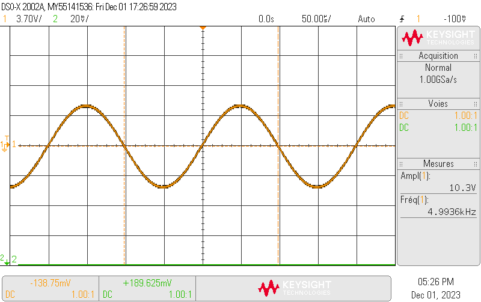
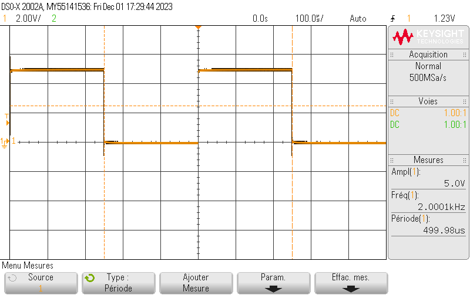
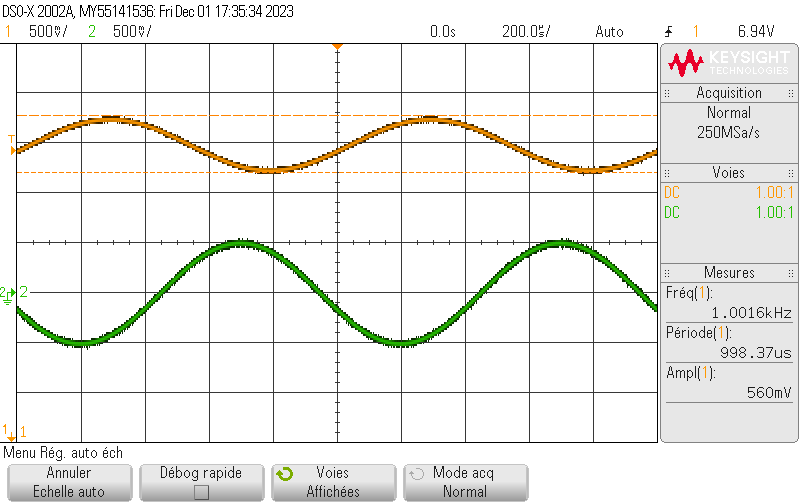
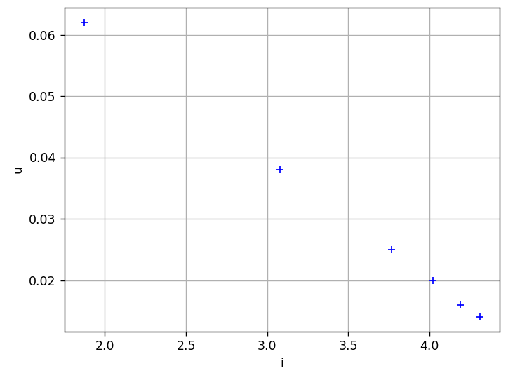

# Introduction à l'utilisation du GBF et de l'oscilloscope

## Génération et observation de signaux

- Cas 1: Signal sinusoïdal de fréquence 5kHz et d'amplitude 5V (10 vpp)



- Cas 2: créneau de 0 à 5V, de période 0.5ms



- Cas 3: signal continu de 5V


Cas 4: Deux signaux sinusoïdaux de fréquence 1kHz, l'un de amplitude 1V et l'autre de 2V avec un déphasage de 30°



## Détermination de la résistance r d'un générateur réel

### Méthode 1: tracé de la caractéristique

Pour tracer la courbe caractéristique du générateur, on mesure le tension a ses bornes et le courant qui le traverse, pour ensuite tracer u en fonction de i.

| U(en V) | I(en A) | R(en Ohm) |
| ------- | ------- | --------- |
| 1.874   | 0.062   | 30        |
| 3.081   | 0.038   | 80        |
| 3.765   | 0.025   | 150       |
| 4.021   | 0.020   | 200       |
| 4.188   | 0.016   | 250       |
| 4.310   | 0.014   | 300       |

Avec le script python suivant, on peut tracer la courbe caractéristique du générateur:

```python
import matplotlib.pyplot as plt

u = [1.874, 3.081, 3.765, 4.021, 4.188, 4.310]
i = [0.062, 0.038, 0.025, 0.020, 0.016, 0.014]

plt.plot(u, i, 'b+')

plt.grid(True)
plt.xlabel("i")
plt.ylabel("u")
plt.show()
```

Ce qui nous donne:



On a bien un droite de pente $\boxed{-r=-50Ohm}$.

### Méthode 2

Avec le circuit que l'on a, on peut déterminer l'expression de la tension au borne du GBF en fonction de sa fem interne $e$, de sa résistance interne $r_s$ ainsi que la résistance variable $X$.

$$
\begin{align}
u &= e - r_si\\
u &= Xi \iff i = \frac{u}{X}\\
Donc \space u &= e- r_s\frac{u}{X}\\
\iff u &= \boxed{\frac{Xe}{X+r_s}}


\end{align}
$$

On remarque que pour $X = r_s$, on a $u=\frac{e}{2}$. On peut alors trouver la valeur de $r_s$ en faisant varier $X$ jusqu'à trouver une tension divisé par 2. Cela nous donne une valeur de la résistance interne de $\boxed{50Ohm}$.
